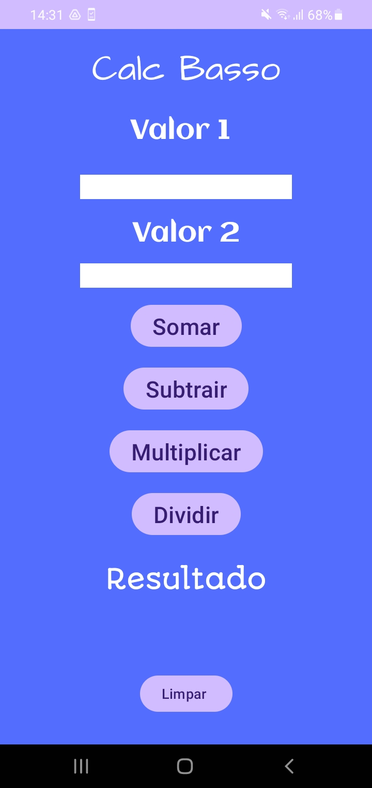

<h1> Calculadora mobile  <h1/>

<h1> Sobre o projeto <h1/>
<h2> Primeiro projeto feito com android studio, linguagem usada: Java. </h2>
  
<h1> Layout mobile </h1>

<h1> BackEnd </h1>
<h2> Java </h2>

<h1> FrontEnd </h1>
<h2> XML activity </h2>

<h1> IDE </h1>
<h2> Android Studio </h2>

<h1> APk do projeto para download </h1>
<h2> https://drive.google.com/file/d/1wb_2EiEoNcLxHgqhhXNyZAg-iE0cB7s4/view?usp=drive_link </h2>

<h1> Pré requisito </h1>
<h2> Android 8 ou superior </h2>

<h1> Autor https://github.com/HerickBasso </h1>
